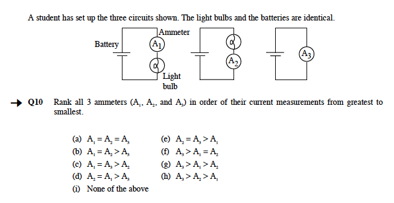
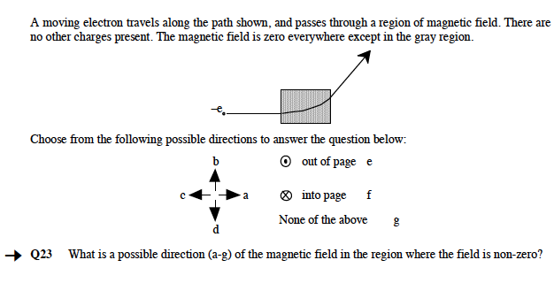

# Implementation

## Course Level: What kinds of courses is it appropriate for?

- Introductory college-calculus-based

## Content: What does it test?

**Electricity and Magnetism**:

- basic electrostatics
- circuits
- magnetic fields and forces
- induction

The content on the BEMA is meant to be the electricity and magnetism topics that would be covered in any introductory second-semester physics course, regardless of the course being taught with traditional or reformed teaching methods. Test items are mostly qualitative questions with a few questions that require only simple calculations.

## Timing: How long does it take?

45 minutes

## Example Questions

## Access: Where do I download the test?

You can download the BEMA here at PhysPort once you have been verified as an educator.

You can also access the test online using WebAssign.

<http://www.webassign.net/features/textbooks/bema1/details.html>

Any instructor who wishes to use WebAssign to administer these assessments, for the express purpose of measuring student learning, may do so at no charge. You can contact customer support for more information.

<http://www.webassign.net/user_support/faculty/>

Instructors who are already using WebAssign in their classes may use these assessments at no additional charge to their students. They are available as Additional Resources and can be easily added to WebAssign courses. By agreement with the authors, instructors are prohibited from using these assessments, or any parts of them, as questions for homework assignments, and from making the answers available to students.

## Versions: Which version of the test should I use

There is only one version of the BEMA.

## Clusters: Does this test include clusters of questions by topic?

There are no official clusters of questions on this test. In one study, the questions were grouped in the following way (Caballero et al., 2012):

Category | Questions 
---------|----------
Electrostatics              | 1–7, 14–16, 18–19
DC Circuits                 | 8–13, 17
Magnetostatics              | 20–27
Faraday's Law and Induction | 28–29, 31

## Pre-test: Should I give this as a pre-test?

BEMA average pre-test scores are usually similar at different institutions. The authors explain that students usually don’t have experience with the E&M topics on the BEMA, so they don’t have everyday knowledge to use to answer the questions (unlike concept inventories in mechanics where students’ everyday knowledge). Because of this, some instructors give the BEMA pre-test for a semester or two just to make sure that their students’ scores are comparable to other intuitions, and then stop giving the BEMA pre- test. Although BEMA scores on average are similar across institutions, student response patterns may not be a result of random guessing (Maloney, O’Kuma, Hieggelke, & Van Heuvelen, 2001). In this case, you could gain insight from looking at the patterns of your students answer choices on the pre-test to learn about their initial ideas about electricity and magnetism content.

## Scoring: How do I calculate my students' scores?

The authors of the BEMA recommend a scoring scheme where some of the questions are given different weighting instead of simply calculating the percentage of questions the students answered correctly or the “raw score”. Here is how you should calculate the total score on the BEMA:

1. Follow the following grading rules for questions 3, 16, 28 and 29:

Question | Grading Rules 
---------|----------
3       | Q3 is counted correct if the answer is 1/9th of the answer to Q2, whether or not Q2 is correct.
16      | Q16 is counted correct if it is the same as the answer to Q14 (whether or not Q14 is correct) and the answer to Q15 is G (zero)
28 & 29 | Both Q28 and Q29 must be correct to get credit (counts as one question)

2. Give one point for correct answer on all other questions.
3. The total points possible is 30. Find the percentage correct for each student out of 30 possible points.
4. Find the average percentage correct for your entire class on the pre-test (if you gave it) and post-test.

## Typical Results: What scores are usually achieved?

Table 1 contains typical pre-test, post-test and normalized gain results from studies at two universities in calculus-based introductory physics courses using different teaching methods.

Course Type | $\mathrm{Pre-test} \pm SE (n)$ | $\mathrm{post-test} \pm SE (n)$ | $\langle g \rangle \pm SE (n)$
----------- | ------------------------ | ------------------------- | -----------------
Interactive Engagement (University of Colorado, Pollock 2007) | $0.26 \pm 0.01 (1584)$ | $0.56 \pm 0.02 (1845)$ | $0.40 \pm 0.02 (1845)$
Matter and Interactions (Georgia Tech, Kohlmeyer 2009) | $0.26 \pm 0.02 (321)$ | $0.58 \pm 0.03 (612)$ | $0.43 \pm 0.02 (612)$
Traditional (George Tech, Kohlmeyer 2009) | $0.25 \pm 0.02 (1319)$ | $0.46 \pm 0.03 (1246)$ | $0.30 \pm 0.01 (1246)$

### Description of Typical Results Studies

Pollock (Pollock, 2007) reports BEMA results (Table 1) for a calculus-based Physics II course at the University of Colorado for a mix of majors (70% engineering), is 76% male, and just over half are sophomores. This was a reformed, large-scale course, with ConcepTests and peer instruction during three 50-minute lectures per week, online homework and one 50-minute per week Tutorial using Washington Tutorials with trained graduate TAs and undergraduate Learning Assistants.
Kohlmeyer (Kohlmyer et al., 2009) compared BEMA scores at four universities in ‘Traditional’ courses and courses that used Matters and Interactions, a research-based curriculum that emphasizes fundamental physical principles, microscopic models of matter, coherence in linking different domains of physics, and computer modeling (Chabay & Sherwood, 2006, 2007). Traditional courses consisted primarily of passive- student lectures, ‘recipe-following’ laboratory sessions and algorithmic quantitative problem solving examinations. Kohlmeyer found that courses taught using Matter and Interactions had higher BEMA post-test scores as well as greater normalized gains (Table 1). These courses contained students of similar majors and were similar instructional environments.

## Interpretation: How do I interpret my students' score in light of typical results?

### Compare your pre-test scores

BEMA pre-test scores are usually similar at different institutions. Students usually don’t have experience with the E&M topics on the BEMA, so they don’t have everyday knowledge to use to answer the questions. You can check to see if your pre-test scores are similar to other institutions by comparing your scores to those in Table 1. On other E&M tests (e.g. the CSEM), the answers students choose on the pre-test questions are not random (even though the average score is what would be produced by guessing). You can also examine the answer choices on individual questions to get a sense of your students’ incoming knowledge about E&M topics.

### Compare your post-test scores

Because there is so little variation in pre-test scores, some instructors choose not to give the pre-test. If you didn’t give the pre-test, you can compare your students’ average post- test scores to the published record (Table 1)

### Compare your normalized gain

If you gave your students the BEMA pre-test, you can calculate average normalized gain and compare your results to the published record (Table 1). Normalized gain scores vary by teaching method, where courses that use interactive engagement teaching methods usually score higher than courses which use traditional teaching method (see Table 1).

Normalized gain values are classified <g> into the following categories (Hake, 1998). These categories are primarily used when discussing FCI gains, but can give you a sense of where your course falls.

Course Type | Gain 
----------- | ------------------------ 
'High gain' courses | $\langle g \rangle > 0.7$
'Medium gain' courses | $0.7 > \langle g \rangle > 0.3$
'Low gain' courses | $\langle g \rangle < 0.3$

# Background

## Similar Tests

The BEMA covers very similar content to the CSEM and these tests contain 5 questions in common (CSEM questions 3,4,5,31 and 32 are the same as BEMA questions 1-3, 30 and 37)

## Variations

There are no variations of the BEMA.

## Research: What research has been done to create and validate the test?

- Questions are based on research into student thinking
- Student interviews
- Expert review
- Appropriate Statistical analysis (factor analysis, IRT, SEM, etc)
- At least one peer-reviewed publication
- Administered at multiple institutions
- Research published by someone other than developers

The distractors (incorrect multiple-choice options) on each question are based on common student responses on open-ended written versions of the questions. Expert physicists evaluated the validity of the content and the degree of coverage. The difficulty of the items was found to be in the optimal range. Most individual items on the BEMA are able to satisfactorily distinguish students who know the material well from those who don’t and almost are found to be consistent with the rest of the test. Another measure was used to assess the self-consistency of the whole test, and the BEMA was found to be satisfactorily self-consistent. The total scores on the BEMA were found to be broadly distributed over the possible range, meaning that the BEMA as a whole has can discriminate well between students (Ding, Chabay, Sherwood, & Beichner, 2006). The BEMA has been used to compare the effectiveness of different teaching and the results published in peer-reviewed publications (Kohlmyer et al., 2009). It has been administered at many different institutions.

## Developer: Who developed this test?

Ruth Chabay and Bruce Sherwood

# References

{empty for now}
